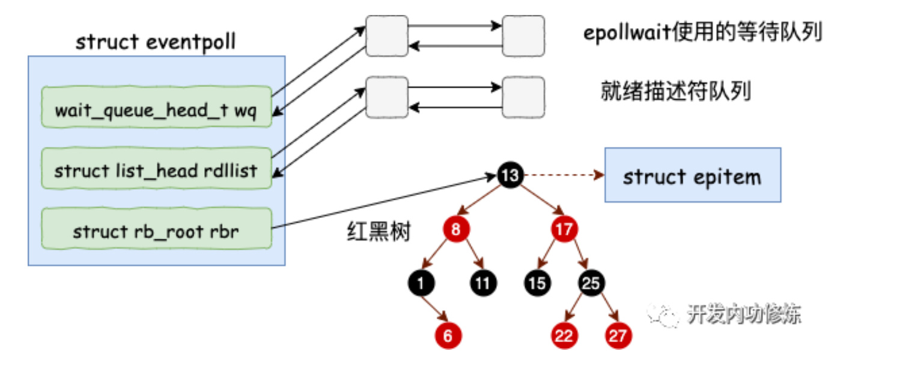
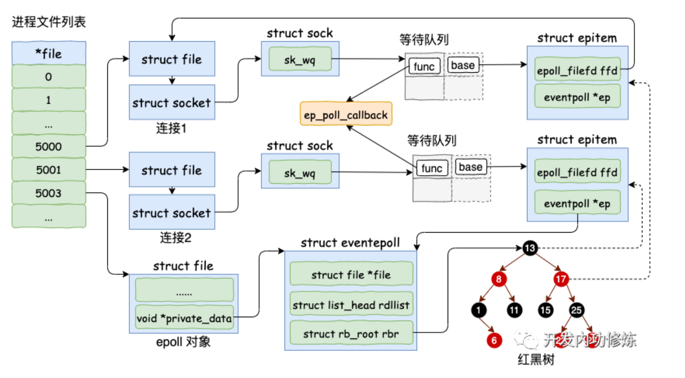
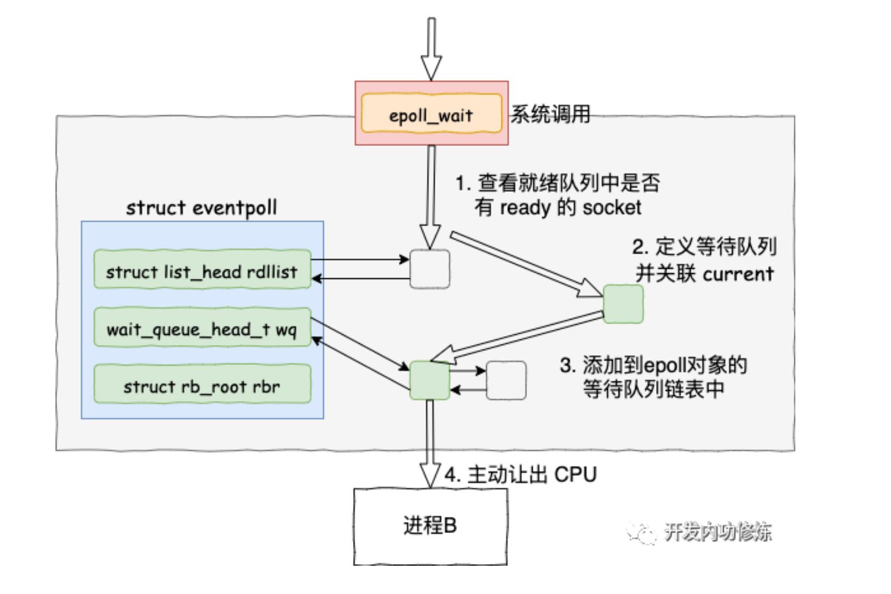
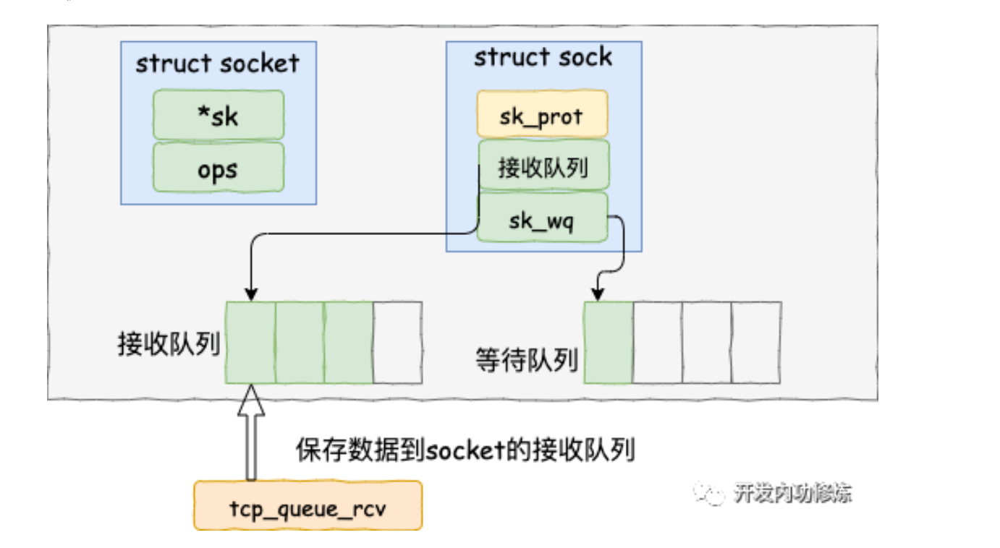
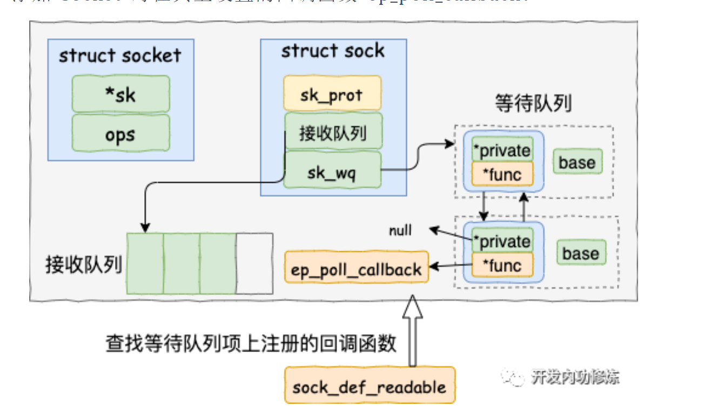
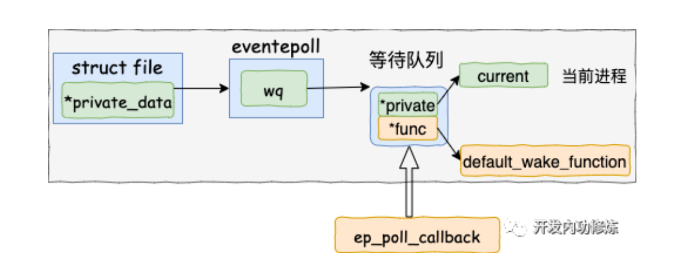
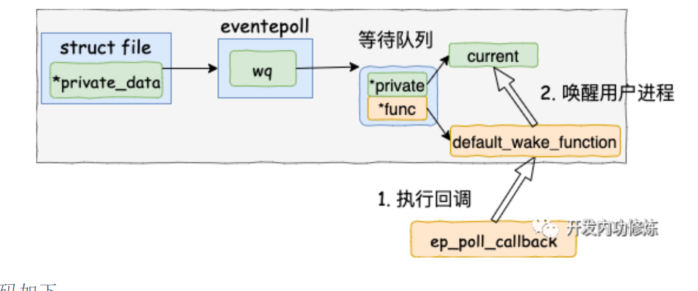

# 深入理解Linux网络

Epoll与Socket的交互逻辑

**准备工作：创建好epoll对象，以及socket对象，并进行关联**

1. epoll_create：创建一个epoll对象，其中包含file指针（进程的文件列表会通过这个指针关联到epoll对象），rdllist（就序列表，用于查找是否有就绪的socket），wq（等待列表，阻塞等待的进程会挂在在这个上面），rbr(红黑树，用于管理epitem)
   

2. epoll_ctl:

   1. 分配一个红黑树节点对象epitem：两个结构，ffd（用于被sock的等待队列项指向），ep指针（指向epoll对象）
   2. 添加等待事件到socket的等待队列中，并注册回调函数为ep_poll_callback
   3. 插入epitem到epoll对象的红黑树中

   

3. epoll_wait:观察就序列表是否有就绪的socket，有就返回，没有则创建一个等待队列项，把当前进程阻塞掉给挂到等待队列上

   

数据来了：如何将数据写到socket中，并通过注册的epoll_callback找到对应在等待的进程并唤醒

1. 把数据写到socket的接收队列中

   

2. 查找就绪回调函数：会调用sock_def_readable函数，找到epoll_ctl添加socket时设置的回调函数ep_poll_callback

   

3. 执行socket就绪回调函数：先找到对应的item，再找到对应的epoll，把当前epitem添加到epoll的就绪队列中，然后判断就绪队列是否有在等待

   

4. 执行epoll就绪通知：在default_wake_function中找到等待队列里的进程描述符，然后唤醒

   

Q：epoll对象中的就绪列表和红黑树的关系是什么？当一个socket接收到数据时，是怎么将就绪的socket放到epoll的就绪列表中的
A：`epoll` 是 Linux 下的一种 I/O 多路复用技术，它可以高效地处理大量并发的 socket 连接。`epoll` 对象中包含两个主要的数据结构：就绪列表（ready list）和红黑树。

1. 就绪列表（ready list）：这是一个链表，用于存储已经就绪的 socket，也就是那些已经可以进行 I/O 操作的 socket。当调用 `epoll_wait` 函数时，内核会将就绪列表中的 socket 返回给用户程序，以便进行相应的 I/O 操作。
2. 红黑树：这是一种自平衡的二叉查找树，用于存储所有注册到 `epoll` 对象上的 socket。红黑树的主要优点是查找、插入和删除操作的时间复杂度都是 O(logN)，这使得它在处理大量 socket 时具有较高的性能。

当一个 socket 接收到数据时，内核会将这个 socket 标记为就绪状态，并将其放入就绪列表中。具体过程如下：

1. 当 socket 接收到数据时，内核会首先检查该 socket 是否已经注册到某个 `epoll` 对象上。这一检查过程是通过在红黑树中查找该 socket 的文件描述符（file descriptor）来实现的。
2. 如果找到了对应的 `epoll` 对象，内核会将该 socket 放入该 `epoll` 对象的就绪列表中。这一过程是通过将 socket 的文件描述符添加到就绪列表的链表节点中来实现的。
3. 当用户程序调用 `epoll_wait` 函数时，内核会将就绪列表中的 socket 返回给用户程序。用户程序可以根据返回的 socket 进行相应的 I/O 操作。

总之，就绪列表和红黑树在 `epoll` 对象中的关系是：红黑树用于存储所有注册到 `epoll` 对象上的 socket，而就绪列表用于存储已经就绪的 socket。当一个 socket 接收到数据时，内核会将其从红黑树中查找出来，然后将其放入就绪列表中。