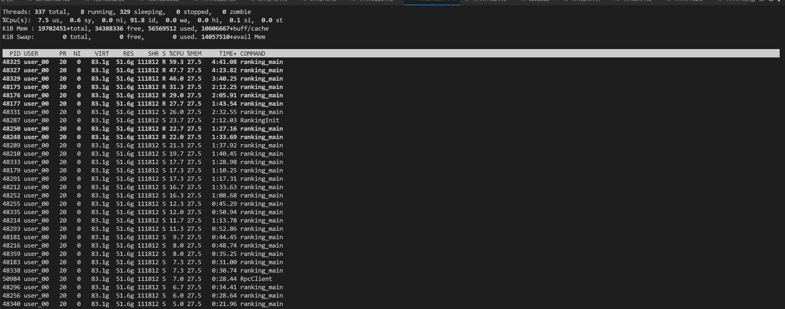

# 性能问题排查手段汇总

> 近期在做RankingServer升级JeMalloc的切换，中间遇到不少问题，故将排查手段整理，用于后面回顾

## 1. top&htop工具

### top工具

可粗略观察，不同进程的CPU使用情况，在本次排查中，就发现了在朋友圈的不少机器上，byteflood进程的CPU使用率达到了**70-80%**，明显不符合预期


- PID:进程ID
- %CPU：进程在所有CPU核心上的相对使用率
- TIME+：进程消耗的累积CPU时间

```
top -H -p pid # 查看进程下的线程
```



问题来了，如果我想看某个占比较高的线程都在做什么，怎么看？
可以通过perf查看

### htop工具


**CPU核心**：可以看到，共有90个核心，每个核心有绿色和红色：

- 绿色： **normal priority thread**， 一般为程序自身在使用
- 红色：**kernel thread** ， 一般是系统调用

**Tasks**：Tasks这一行表示，该进程一共有98个进程，778线程，正在运行26个线程

**Load average**:用來判断目前系統有多繁忙，三個數字代表的是系統在**最近 1分鐘、5分鐘、15 分鐘內，平均有多少個 thread 需要 CPU**

**PID**：进程ID or 线程ID，可通过大写的**H**切换

[htop详解]: https://medium.com/starbugs/do-you-understand-htop-ffb72b3d5629

## 2.Perf工具

以下来自chatgpt

`perf` 是一个 Linux 性能分析工具，用于收集和分析系统和应用程序的性能数据。它是 Linux 内核的一部分，基于内核中的性能计数器（Performance Counters）子系统（也称为 `perf_events`）工作。性能计数器是一种硬件功能，用于收集处理器、内存和其他硬件组件的性能信息。

`perf` 的工作原理如下：

1. 收集数据：`perf` 使用内核中的 `perf_events` 子系统来收集各种性能数据。这些数据可以包括硬件事件（如缓存命中/未命中、分支预测错误等）、软件事件（如上下文切换、内核调用等）以及自定义事件。要收集数据，`perf` 需要在系统上启用内核配置选项 `CONFIG_PERF_EVENTS`。
2. 记录数据：`perf` 可以将收集到的性能数据记录到文件中，以便稍后进行分析。这可以通过 `perf record` 命令来完成。`perf record` 会将数据保存到一个名为 `perf.data` 的文件中，这个文件包含了二进制格式的原始性能计数器数据。
3. 分析数据：`perf` 提供了一系列工具来分析收集到的性能数据。例如，`perf report` 可以生成一个基于 `perf.data` 文件的可读报告，展示各个函数或指令在性能问题上的影响。还有其他工具，如 `perf annotate`、`perf stat`、`perf top` 等，可以提供不同层次和视角的性能分析。
4. 可视化数据：`perf` 还提供了一些可视化工具，如 `perf timechart`、`perf trace` 和 `perf script`，它们可以帮助用户更直观地理解性能数据。

总之，`perf` 是一个强大的 Linux 性能分析工具，通过收集和分析内核中的性能计数器数据来帮助用户诊断系统和应用程序的性能问题。它提供了一系列命令和可视化工具，以便用户更好地理解和解决性能瓶颈。

```bash
perf top # 可粗略的看到，哪些任务是cpu的热点
```


```bash
perf top -p pid # 查看某个进程的热点
```


```bash
perf top --cpu=xx # 查看某个核心的热点
perf top -g # 展开各事件
```


```bash
perf record #记录perf文件
perf record -t tid -g sleep 10 # 记录某线程的执行情况
```

然后perf report查看

```
perf report # 可支持dump堆栈
```


同时选中某个热点，可以enter进去，annotate查看具体函数


或者

```
perf report --stdio # 以标准输入输出方式展示
```


```bash
perf trace -p pid -s 10 # 分析具体的系统调用
```

```bash
perf stat -p 23139 # 查看进程的运行信息
```


```
perf stat --topdown # 仅intel支持，从系统层次（system wide）对分支预测、cache命中情况、上下文切换、缓存读取、缺页异常、分支预测错误率等性能指标进行统计
```


```bash
perf stat -e branch-misses,cache-misses,cpu-cycles,instructions,branch-loads,branch-loads-misses -p 73267 sleep 1 # 观察各事件的执行次数
```


### **perf火焰图**

- 安装FlameGraph:

  ```
  git clone https://github.com/brendangregg/FlameGraph.git
  ```

- 执行以下步骤

  ```
  # perf record -e cpu-clock -g -p 29989
  //Ctrl+c结束执行后，在当前目录下会生成采样数据perf.data.（以cpu周期采样）
  # perf script -i perf.data &> perf.unfold     
  //生成脚本文件，用perf script工具对perf.data进行解析
  # ./stackcollapse-perf.pl perf.unfold &> perf.folded
  //将perf.unfold中的符号进行折叠：              
  # ./flamegraph.pl perf.folded > perf.svg   
  //执行完成后生成perf.svg图片，可以下载到本地，用浏览器打开 perf.svg，如下图
  ```

  ****

## 3.TMA工具

前提：依赖tmu-tools

perf与tma关系，见文档：https://doc.weixin.qq.com/doc/w3_AXQAiwa_ABg0QO11LehQ4axVr7FLU?scode=AJEAIQdfAAo8MQpXteAXQAiwa_ABg

```
./toplev -v -l3 --no-desc --global --show-sample sleep 10s # 查看三个级别的占比
```


