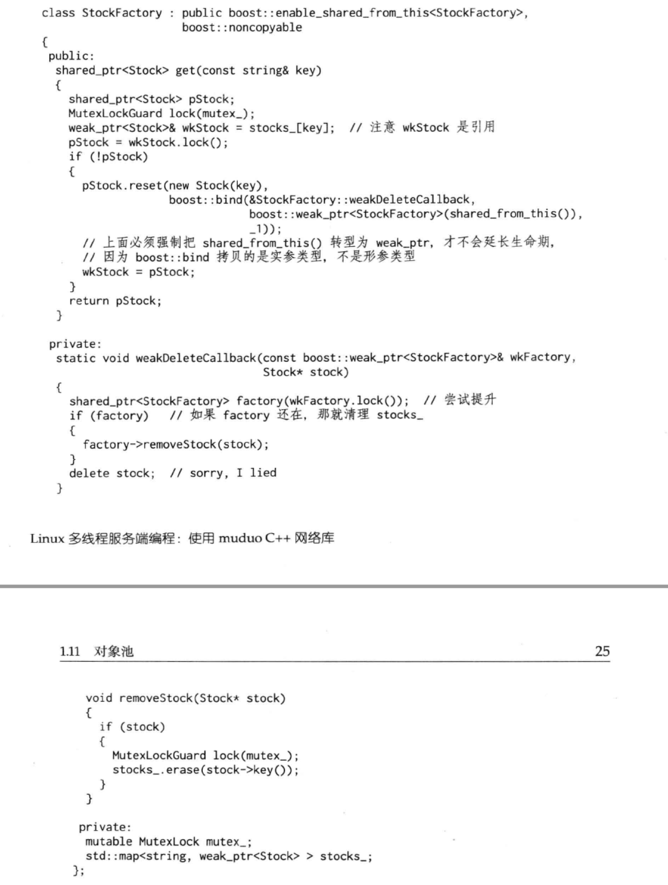
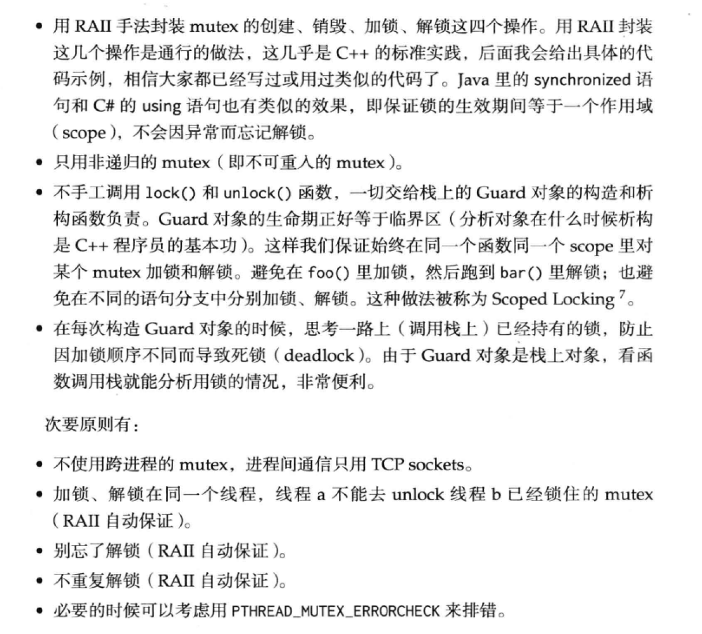

# Muduo网络库学习

muduo网络库运行：https://blog.csdn.net/whutshiliu/article/details/106479289

linux下没有core文件的解决办法：https://www.jianshu.com/p/7317910210a4

## 一、C++多线程系统编程

### 第1章 线程安全的对象生命期管理

#### 1.1 当析构函数遇到多线程

当一个对象能被多个线程同时看到时，对象的销毁时机就很难把握，会出现多种竞态条件：

- 在即将析构一个对象时,从何而知此刻是否有别的线程正在执行该对象的成员函数?
- 如何保证在执行成员函数期间,对象不会在另一个线程被析构?
- 在调用某个对象的成员函数之前,如何得知这个对象还活着?它的析构函数会不会碰巧执行到一半?

##### 线程安全的定义

- 多个线程同时访问时,其表现出正确的行为
- 无论操作系统如何调度这些线程,无论这些线程的执行顺序如何交织
- 调用端代码无须额外的同步或其他协调动作。

##### 线程安全的Counter示例


#### 1.2 对象构造做到线程安全

- 不要在构造函数中注册任何回调
- 也不要在构造函数中把this传给跨线程的对象
- 即便在构造函数的最后一行也不行

#### 1.3 对象析构做到线程安全

- 仅用mutex无法做到，如下：


##### 作为数据成员的mutex不能保护析构

因为MutexLock成员的生命周期最多与对象一样长

#### 1.4 线程安全的Observer如何实现

**一个动态创建的对象是否还活着，光靠指针是看不出来的**

简单的解决办法：只创建不销毁，使用对象池子暂存用过的对象，但存在以下问题：

- 对象池的线程安全,如何安全地、完整地把对象放回池子里,防止出现“部分放回”的竞态?(线程A认为对象x已经放回了,线程B认为对象x还活着。)
- 全局共享数据引发的 lock contention,这个集中化的对象池会不会把多线程并发的操作串行化?
- 如果共享对象的类型不止一种,那么是重复实现对象池还是使用类模板?
- 会不会造成内存泄漏与分片?因为对象池占用的内存只增不减,而且多个对象池不能共享内存(想想为何)。


以上代码有两个race condition：

1. 线程A执行到32行，还没有来得及unregister对象
2. 线程B执行到17行，x正好指向32行在析构的对象

#### 1.5 通过共享指针避免普通指针存在的问题

C++可能出现的内存问题：

1. 缓冲区溢出
2. 空指针/野指针
3. 重复释放
4. 内存泄漏
5. 不配对的new[]/delete
6. 内存碎片

正确使用指针智能指针可以解决如下问题：

1. 缓冲区溢出:用std:: vector<char>/std:: string或自己编写 Buffer class来管理缓冲区,自动记住用缓冲区的长度,并通过成员函数而不是裸指针来修改缓冲区
2. 空悬指针/野指针:用 shared_ptr/weak_ptr,这正是本章的主题。
3. 重复释放:用 scoped_ptr,只在对象析构的时候释放一次。
4. 内存泄漏:用 scoped_ptr,对象析构的时候自动释放内存。
5. 不配对的new]/ delete:把new统统替换为std: vector/ scoped_ array

#### 1.6 应用到Observer上


以上代码并非完全线程安全：

- 侵入性强制要求 Observer必须以 shared_ptr来管理
- 不是完全线程安全 observer的析构函数会调用 subject_- >unregister(this),万一 subject-已经不复存在了呢?为了解决它,又要求 Observable本身是用shared_ptr管理的,并且 subject-多半是个weak_ptr< observable>
- 锁争用(1 ock contention)即 Observable的三个成员函数都用了互斥器来同步,这会造成 register_()和 unregister()等待 notifyobservers(),而后者的执行时间是无上限的,因为它同步回调了用户提供的 update()函数。我们希望register_()和 unregister()的执行时间不会超过某个固定的上限,以免殃及无辜群众。
- 死锁万一C62的 update()虚函数中调用了( un)register呢?如果 mutex是不可重入的,那么会死锁;如果 mutex是可重入的,程序会面临迭代器失效(coredump是最好的结果),因为 vector observers_在遍历期间被意外地修改了。这个问题乍看起来似乎没有解决办法,除非在文档里做要求。(一种办法是:用可重入的mutex_,把容器换为std:list,并把++it往前挪一行。)

#### 1.7 shared_ptr的线程安全

- 一个 shared_ptr对象实体可被多个线程同时读取
- 两个 shared_ptr对象实体可以被两个线程同时写入,“析构”算写操作
- 如果要从多个线程读写同一个 shared_ptr对象,那么需要加锁。

#### 1.8 shared_ptr技术与陷阱

- 意外对象的生命期：遗留了一个拷贝，对象就永世长存了
- 函数参数：因为要修改引用计数（而且拷贝的时候通常要加锁），shared_ptr的拷贝开销比拷贝原始指针要高，因此不需要的时候使用const reference方式传递
- 析构动作在创建时被捕获：
  - 虚析构不再是必需的。
  - shared_ptr<void>可以持有任何对象,而且能安全地释放。
  - shared_ptr对象可以安全地跨越模块边界,比如从DLL里返回,而不会造成从模块A分配的内存在模块B里被释放这种错误。
  - 二进制兼容性,即便Foo对象的大小变了,那么旧的客户代码仍然可以使用新的动态库,而无须重新编译。前提是Foo的头文件中不出现访问对象的成员的nine函数,并且Fo0对象的由动态库中的 Factory构造,返回其 shared_ptr析构动作可以定制。
- 在当前线程析构：对象的析构是同步的，当最后一个指向x的shared_ptr离开其作用域时，x会同时在同一个线程析构。

#### 1.9 shared_ptr定制析构函数

假设有一个对象池，可以根据key返回对象，在多线程程序中，为了避免对象直接被销毁，因此返回shared_ptr，如下：


get()逻辑：在stocks_找到key，就返回stocks\_[key],否则新创建一个Stock并存入

**问题**：

- shared_ptr保存的对象永远不会被销毁

**解决办法**：通过weak_ptr保存，如下：


**存在问题**：对象池大小没改变，即使内部对象删除了，外部也无法访问对象池的那部分内存，导致内存泄漏

**解决办法**：利用shared_ptr的定制析构功能


**存在问题**：如果在析构Stock对象的时候，StockFactory先于Stock析构，就会coredump

#### enable_shared_from_this

**解决办法**：获得一个指向当前对象的shared_ptr，如下：


**存在问题**：由于this指针变成了shared_ptr传给了stock对象，那么就延长了StockFactory的生命周期

#### 弱回调

**解决办法**：利用weak_ptr,在回调的时候先尝试提升shared_ptr，如果提升成功，说明接受回调的对象还健在，那么就执行回调，否则不执行



#### 小结

- 原始指针暴露给多个线程往往会造成多个竞态条件
- 统一用shared_ptr/scoped_ptr来管理对象的生命期，在多线程中尤其重要
- shared_ptr是值语意，当心意外延长对象的生命期，如boost:bind和容器都有可能拷贝shared_ptr
- weak_ptr是shared_ptr的好搭档

### 第2章 线程同步精要

#### 2.1 互斥器



##### 2.1.1 只使用非递归的mutex

原因：可重入锁容易无法发现问题，导致coredump，如下


可能的结果：

- mutex是不可重入的，于是死锁
- mutex是递归的，由于push_back()可能导致vector迭代器失效，程序偶尔会core

##### 2.1.2 死锁

**同线程死锁**


**多线程死锁**

AB线程加锁顺序相反

```c++
class Request;

class Inventory
{
 public:
  void add(Request* req)
  {
    muduo::MutexLockGuard lock(mutex_);
    requests_.insert(req);
  }

  void remove(Request* req) __attribute__ ((noinline))
  {
    muduo::MutexLockGuard lock(mutex_);
    requests_.erase(req);
  }

  void printAll() const;

 private:
  mutable muduo::MutexLock mutex_;
  std::set<Request*> requests_;
};

Inventory g_inventory;

class Request
{
 public:
  void process() // __attribute__ ((noinline))
  {
    muduo::MutexLockGuard lock(mutex_);
    g_inventory.add(this);
    // ...
  }

  ~Request() __attribute__ ((noinline))
  {
    muduo::MutexLockGuard lock(mutex_);
    sleep(1);
    g_inventory.remove(this);
  }

  void print() const __attribute__ ((noinline))
  {
    muduo::MutexLockGuard lock(mutex_);
    // ...
  }

 private:
  mutable muduo::MutexLock mutex_;
};

void Inventory::printAll() const
{
  muduo::MutexLockGuard lock(mutex_);
  sleep(1);
  for (std::set<Request*>::const_iterator it = requests_.begin();
      it != requests_.end();
      ++it)
  {
    (*it)->print();
  }
  printf("Inventory::printAll() unlocked\n");
}

/*
void Inventory::printAll() const
{
  std::set<Request*> requests
  {
    muduo::MutexLockGuard lock(mutex_);
    requests = requests_;
  }
  for (std::set<Request*>::const_iterator it = requests.begin();
      it != requests.end();
      ++it)
  {
    (*it)->print();
  }
}
*/

void threadFunc()
{
  Request* req = new Request;
  req->process();
  delete req;
}

int main()
{
  muduo::Thread thread(threadFunc);
  thread.start();
  usleep(500 * 1000);
  g_inventory.printAll();
  thread.join();
}
```


#### 2.2 条件变量

1. 必须与mutex一起使用，该布尔表达式的读写受此mutex保护
2. 在mutex上锁的情况下才能调用wait
3. 把判断布尔条件和wait()放到循环外


必须用循环的原因：如果用if，短暂的判空了，如果获得了锁，就会继续执行下去，但有可能实际还是空的，无法起到阻塞的作用

倒计时（CountDownLatch）是一种常用且易用的同步手段，主要有两种用途：

1. 主线程发起多个子线程，等这些子线程各自都完成一定的任务之后，主线程才继续执行。通常用于主线程等待多个子线程完成初始化
2. 主线程发起多个子线程，子线程都等待主线程，主线程完成其他一些任务之后通知所有子线程开始执行。通常用于多个子线程等待主线程发出“起跑”命令

**GUARD_BY**:数据成员的属性，该属性声明数据成员受给定功能保护。对数据的读操作需要共享访问，而写操作则需要互斥访问。
该 GUARDED_BY属性声明线程必须先锁定mutex_才能对其进行读写condition\_，从而确保增量和减量操作是原子的
**notify() 方法随机唤醒对象的等待池中的一个线程，进入锁池；notifyAll() 唤醒对象的等待池中的所有线程，进入锁池**

```c++
class CountDownLatch : noncopyable
{
 public:

  explicit CountDownLatch(int count);

  void wait();

  void countDown();

  int getCount() const;

 private:
  mutable MutexLock mutex_;
  Condition condition_ GUARDED_BY(mutex_);
  int count_ GUARDED_BY(mutex_);
};

CountDownLatch::CountDownLatch(int count)
  : mutex_(),
    condition_(mutex_),
    count_(count)
{
}

void CountDownLatch::wait()
{
  MutexLockGuard lock(mutex_);
  while (count_ > 0)
  {
    condition_.wait();
  }
}

void CountDownLatch::countDown()
{
  MutexLockGuard lock(mutex_);
  --count_;
  if (count_ == 0)
  {
    condition_.notifyAll();
  }
}

int CountDownLatch::getCount() const
{
  MutexLockGuard lock(mutex_);
  return count_;
}

```

#### 2.3 不要用读写锁和信号量

#### 2.4 封装MutexLock、MutexLockGuard、Condition

```c++
class CAPABILITY("mutex") MutexLock : noncopyable
{
 public:
  MutexLock()
    : holder_(0)
  {
    MCHECK(pthread_mutex_init(&mutex_, NULL));
  }

  ~MutexLock()
  {
    assert(holder_ == 0);
    MCHECK(pthread_mutex_destroy(&mutex_));
  }

  // must be called when locked, i.e. for assertion
  bool isLockedByThisThread() const
  {
    return holder_ == CurrentThread::tid();
  }

  void assertLocked() const ASSERT_CAPABILITY(this)
  {
    assert(isLockedByThisThread());
  }

  // internal usage

  void lock() ACQUIRE()
  {
    MCHECK(pthread_mutex_lock(&mutex_));
    assignHolder();
  }

  void unlock() RELEASE()
  {
    unassignHolder();
    MCHECK(pthread_mutex_unlock(&mutex_));
  }

  pthread_mutex_t* getPthreadMutex() /* non-const */
  {
    return &mutex_;
  }

 private:
  friend class Condition;

  class UnassignGuard :
  {
   public:
    explicit UnassignGuard(MutexLock& owner)
      : owner_(owner)
    {
      owner_.unassignHolder();
    }

    ~UnassignGuard()
    {
      owner_.assignHolder();
    }

   private:
    MutexLock& owner_;
  };

  void unassignHolder()
  {
    holder_ = 0;
  }

  void assignHolder()
  {
    holder_ = CurrentThread::tid();
  }

  pthread_mutex_t mutex_;
  pid_t holder_;
};

// Use as a stack variable, eg.
// int Foo::size() const
// {
//   MutexLockGuard lock(mutex_);
//   return data_.size();
// }
class SCOPED_CAPABILITY MutexLockGuard : noncopyable
{
 public:
  explicit MutexLockGuard(MutexLock& mutex) ACQUIRE(mutex)
    : mutex_(mutex)
  {
    mutex_.lock();
  }

  ~MutexLockGuard() RELEASE()
  {
    mutex_.unlock();
  }

 private:

  MutexLock& mutex_;
};

}  // namespace muduo

// Prevent misuse like:
// MutexLockGuard(mutex_);
// A tempory object doesn't hold the lock for long!
#define MutexLockGuard(x) error "Missing guard object name"
```


```c++
class CountDownLatch : noncopyable
{
 public:

  explicit CountDownLatch(int count);

  void wait();

  void countDown();

  int getCount() const;

 private:
  mutable MutexLock mutex_;
  Condition condition_ GUARDED_BY(mutex_);
  int count_ GUARDED_BY(mutex_);
};

CountDownLatch::CountDownLatch(int count)
  : mutex_(),
    condition_(mutex_),
    count_(count)
{
}

void CountDownLatch::wait()
{
  MutexLockGuard lock(mutex_);
  while (count_ > 0)
  {
    condition_.wait();
  }
}

void CountDownLatch::countDown()
{
  MutexLockGuard lock(mutex_);
  --count_;
  if (count_ == 0)
  {
    condition_.notifyAll();
  }
}

int CountDownLatch::getCount() const
{
  MutexLockGuard lock(mutex_);
  return count_;
}
```

#### 2.5 线程安全的单例类

**pthread_once**：在多线程的环境下，有些事仅仅需要执行一次。通常会把这个初始化放在mian函数中，当你写一个库的时候就不能放在main函数中了，这个时候你可以考虑pthread_once

```c++
int pthread_once(pthread_once_t* once_control, void(*init_routine)(void));
//本函数使用初值为PTHREAD_ONCE_INIT的once_control变量保证init_routine()函数在本进程执行序列中仅仅执行一次。
```

```c++
namespace muduo
{

namespace detail
{
// This doesn't detect inherited member functions!
// http://stackoverflow.com/questions/1966362/sfinae-to-check-for-inherited-member-functions
template<typename T>
struct has_no_destroy
{
  template <typename C> static char test(decltype(&C::no_destroy));
  template <typename C> static int32_t test(...);
  const static bool value = sizeof(test<T>(0)) == 1;
};
}  // namespace detail

template<typename T>
class Singleton : noncopyable
{
 public:
  Singleton() = delete;
  ~Singleton() = delete;

  static T& instance()
  {
    pthread_once(&ponce_, &Singleton::init);
    assert(value_ != NULL);
    return *value_;
  }

 private:
  static void init()
  {
    value_ = new T();
    if (!detail::has_no_destroy<T>::value)
    {
      ::atexit(destroy);
    }
  }

  static void destroy()
  {
    typedef char T_must_be_complete_type[sizeof(T) == 0 ? -1 : 1];
    T_must_be_complete_type dummy; (void) dummy;

    delete value_;
    value_ = NULL;
  }

 private:
  static pthread_once_t ponce_;
  static T*             value_;
};

template<typename T>
pthread_once_t Singleton<T>::ponce_ = PTHREAD_ONCE_INIT;

template<typename T>
T* Singleton<T>::value_ = NULL;

}  // namespace muduo
```

#### 2.6 sleep(3)不是同步原语

#### 2.7 归纳与总结

- 线程同步的四项原则，尽量用高层同步设施（线程池、队列、倒计时）
- 使用普通互斥器和条件变量完成剩余的工作，采用RAII惯用手法和Scoped Locking

#### 2.8 借shared_ptr实现copy_on_write

- shared_ptr是引用计数型智能指针,如果当前只有一个观察者,那么引用计数的值为1。
- 对于 write端,如果发现引用计数为1,这时可以安全地修改共享对象,不必担心有人正在读它。
- 对于read端,在读之前把引用计数加1,读完之后减1,这样保证在读的期间其引用计数大于1,可以阻止并发写。
- 比较难的是,对于 write端,如果发现引用计数大于1,该如何处理? sleep()小段时间肯定是错的。

**解决2.1.1的死锁问题**

```c++
class Foo
{
 public:
  void doit() const;
};

typedef std::vector<Foo> FooList;
typedef boost::shared_ptr<FooList> FooListPtr;
FooListPtr g_foos;
MutexLock mutex;

void post(const Foo& f)
{
  printf("post\n");
  MutexLockGuard lock(mutex);
  if (!g_foos.unique())
  {
    g_foos.reset(new FooList(*g_foos)); // 拷贝一份，不干扰读的线程，等读的线程结束了，会自动释放原来的那部分内存
    printf("copy the whole list\n");
  }
  assert(g_foos.unique());
  g_foos->push_back(f);
}

void traverse()
{
  FooListPtr foos;
  {
    MutexLockGuard lock(mutex);
    foos = g_foos;
    assert(!g_foos.unique());
  }

  // assert(!foos.unique()); this may not hold

  for (std::vector<Foo>::const_iterator it = foos->begin();
      it != foos->end(); ++it)
  {
    it->doit();
  }
}

void Foo::doit() const
{
  Foo f;
  post(f);
}

int main()
{
  g_foos.reset(new FooList);
  Foo f;
  post(f);
  traverse();
}
```

**解决2.1.2把print移出printAll的问题**

```c++

class Inventory
{
 public:
  Inventory()
    : requests_(new RequestList)
  {
  }

  void add(Request* req)
  {
    muduo::MutexLockGuard lock(mutex_);
    if (!requests_.unique())
    {
      requests_.reset(new RequestList(*requests_));
      printf("Inventory::add() copy the whole list\n");
    }
    assert(requests_.unique());
    requests_->insert(req);
  }

  void remove(Request* req) // __attribute__ ((noinline))
  {
    muduo::MutexLockGuard lock(mutex_);
    if (!requests_.unique())
    {
      requests_.reset(new RequestList(*requests_));
      printf("Inventory::remove() copy the whole list\n");
    }
    assert(requests_.unique());
    requests_->erase(req);
  }

  void printAll() const;

 private:
  typedef std::set<Request*> RequestList;
  typedef boost::shared_ptr<RequestList> RequestListPtr;

  RequestListPtr getData() const
  {
    muduo::MutexLockGuard lock(mutex_);
    return requests_;
  }

  mutable muduo::MutexLock mutex_;
  RequestListPtr requests_;
};

Inventory g_inventory;

class Request
{
 public:
  Request()
    : x_(0)
  {
  }

  ~Request() __attribute__ ((noinline))
  {
    muduo::MutexLockGuard lock(mutex_);
    x_ = -1;
    sleep(1);
    g_inventory.remove(this);
  }

  void process() // __attribute__ ((noinline))
  {
    muduo::MutexLockGuard lock(mutex_);
    g_inventory.add(this);
    // ...
  }

  void print() const __attribute__ ((noinline))
  {
    muduo::MutexLockGuard lock(mutex_);
    // ...
    printf("print Request %p x=%d\n", this, x_);
  }

 private:
  mutable muduo::MutexLock mutex_;
  int x_;
};

void Inventory::printAll() const
{
  RequestListPtr requests = getData();
  sleep(1);
  for (std::set<Request*>::const_iterator it = requests->begin();
      it != requests->end();
      ++it)
  {
    (*it)->print();
  }
}

void threadFunc()
{
  Request* req = new Request;
  req->process();
  delete req;
}

int main()
{
  muduo::Thread thread(threadFunc);
  thread.start();
  usleep(500*1000);
  g_inventory.printAll();
  thread.join();
}
```

**解决对象析构的race condition**

```c++
class Request;
typedef boost::shared_ptr<Request> RequestPtr;

class Inventory
{
 public:
  Inventory()
    : requests_(new RequestList)
  {
  }

  void add(const RequestPtr& req)
  {
    muduo::MutexLockGuard lock(mutex_);
    if (!requests_.unique())
    {
      requests_.reset(new RequestList(*requests_));
      printf("Inventory::add() copy the whole list\n");
    }
    assert(requests_.unique());
    requests_->insert(req);
  }

  void remove(const RequestPtr& req) // __attribute__ ((noinline))
  {
    muduo::MutexLockGuard lock(mutex_);
    if (!requests_.unique())
    {
      requests_.reset(new RequestList(*requests_));
      printf("Inventory::remove() copy the whole list\n");
    }
    assert(requests_.unique());
    requests_->erase(req);
  }

  void printAll() const;

 private:
  typedef std::set<RequestPtr> RequestList;
  typedef boost::shared_ptr<RequestList> RequestListPtr;

  RequestListPtr getData() const
  {
    muduo::MutexLockGuard lock(mutex_);
    return requests_;
  }

  mutable muduo::MutexLock mutex_;
  RequestListPtr requests_;
};

Inventory g_inventory;

class Request : public boost::enable_shared_from_this<Request>
{
 public:
  Request()
    : x_(0)
  {
  }

  ~Request()
  {
    x_ = -1;
  }

  void cancel() __attribute__ ((noinline))
  {
    muduo::MutexLockGuard lock(mutex_);
    x_ = 1;
    sleep(1);
    printf("cancel()\n");
    g_inventory.remove(shared_from_this());
  }

  void process() // __attribute__ ((noinline))
  {
    muduo::MutexLockGuard lock(mutex_);
    g_inventory.add(shared_from_this());
    // ...
  }

  void print() const __attribute__ ((noinline))
  {
    muduo::MutexLockGuard lock(mutex_);
    // ...
    printf("print Request %p x=%d\n", this, x_);
  }

 private:
  mutable muduo::MutexLock mutex_;
  int x_;
};

void Inventory::printAll() const
{
  RequestListPtr requests = getData();
  printf("printAll()\n");
  sleep(1);
  for (std::set<RequestPtr>::const_iterator it = requests->begin();
      it != requests->end();
      ++it)
  {
    (*it)->print();
  }
}

void threadFunc()
{
  RequestPtr req(new Request);
  req->process();
  req->cancel();
}

int main()
{
  muduo::Thread thread(threadFunc);
  thread.start();
  usleep(500*1000);
  g_inventory.printAll();
  thread.join();
}
```

## 第3章 多线程服务器的适用场合与常用编程模型

### 3.1 多线程服务器的常用编程模型

#### 3.1.1 one loop per thread

此种模式下，程序里的每个IO线程有一个event loop（或者叫Reactor），用于处理读写和定时时间

好处：

1. 线程数目基本固定，可以在程序启动的时候设置，不会频繁创建与销毁
2. 可以很方便的在线程间调配负载
3. IO事件发生的线程是固定的，同一个TCP连接不必考虑事件并发

#### 3.1.2 线程池

对于没有IO光有计算任务的线程，使用event loop有点浪费，可以使用blocking queue实现的任务队列


#### 3.1.3 推荐模式

one loop per thread + thread pool

- event loop用作IO multiplexing，配合non-blocking IO和定时器
- thread pool用来做计算，具体可以是任务队列或生产者消费者队列

### 3.2 进程间通信只用TCP

- 进程间通信首选sockets：可以跨主机，具有伸缩性

#### 3.2.1 分布式系统中使用TCP长连接通信

- 容易定位分布式系统中的服务之间的依赖关系，只要在机器上运行 netstat -tpna | grep :port就能立刻列出用到某服务的客户端地址，然后在客户端的机器上用netstat或lsof命令找出是哪个进程发起的链接
- 通过接收和发送队列的长度，也比较容易定位网络或程序故障

### 3.3 多线程服务器的适用场合

- 当“线程”很廉价时,一台机器上可以创建远高于CPU数目的“线程”。这时一个线程只处理一个TCP连接(甚至半个),通常使用阻塞IO至少看起来如此)。例如, Python gevent、 Go goroutine、 Erlang actor。这里的“线程”由语言的 runtime自行调度,与操作系统线程不是一回事。
- 当线程很宝贵时,一台机器上只能创建与CPU数目相当的线程。这时一个线程要处理多个TCP连接上的IO,通常使用非阻塞IO和IO multiplexing。例如,libevent、 mudu、 Netty。这是原生线程,能被操作系统的任务调度器看见。
- 阻塞IO调用：在用户进程（线程）中调用执行的时候，进程会等待该IO操作，而使得其他操作无法执行。 
- 非阻塞IO调用：在用户进程中调用执行的时候，无论成功与否，该IO操作会立即返回，之后进程可以进行其他操作（当然如果是读取到数据，一般就接着进行数据处理）。

#### 3.3.1 必须用单线程的场合

- 程序可能回fork(2)
- 限制程序的CPU占用率

#### 3.3.2 适用多线程程序的场景

适用场景：提高响应速度，让IO和”计算“相互重叠，降低latency。虽然多线程不能提高绝对性能，但能提高平均响应性能

一个程序要做成多线程的，大致要满足：

- 有多个CPU可用。单核机器上多线程没有性能优势(但或许能简化并发业务逻辑的实现)。
- 线程间有共享数据,即内存中的全局状态。如果没有共享数据,用模型3b就行。虽然我们应该把线程间的共享数据降到最低,但不代表没有。
- 共享的数据是可以修改的,而不是静态的常量表。如果数据不能修改,那么可以在进程间用 shared memory,模式3就能胜任。
- 提供非均质的服务。即,事件的响应有优先级差异,我们可以用专门的线程来处理优先级高的事件。防止优先级反转。
- latency和 throughput同样重要,不是逻辑简单的 IO bound或 CPU bound程序。换言之,程序要有相当的计算量
- 利用异步操作。比如 logging。无论往磁盘写 log file,还是往 log server发送消息都不应该阻塞 critical path能 scale up。一个好的多线程程序应该能享受增加CPU数目带来的好处,目前主流是8核,很快就会用到16核的机器了。
- 具有可预测的性能。随着负载增加,性能缓慢下降,超过某个临界点之后会急速下降。线程数目一般不随负载变化。
- 多线程能有效地划分责任与功能,让每个线程的逻辑比较简单,任务单一,便于编码。而不是把所有逻辑都塞到一个 event loop里,不同类别的事件之间相互影响。

## 第4章 C++多线程系统编程精要

### 4.1 基本线程原语的选用

最基本的Pthreads函数：


### 4.2 C/C++系统库的线程安全性

C++的标准库容器和std::string都不是线程安全的，只有std::allocator保证是线程安全的

### 4.3 Linux上的线程标识

POsⅨ threads库提供了 pthread_self函数用于返回当前进程的标识符,其类型为 pthread_t。 pthread_t不一定是一个数值类型(整数或指针),也有可能是一个结构体,因此 Pthreads专门提供了 pthread_equal函数用于对比两个线程标识符是否相等。这就带来一系列问题,包括

- 无法打印输出 pthread_t,因为不知道其确切类型。也就没法在日志中用它表示当前线程的id。
- 无法比较 pthread_t的大小或计算其hash值,因此无法用作关联容器的key
- 无法定义一个非法的 pthread_t值,用来表示绝对不可能存在的线程id,因此Mutexlock class没有办法有效判断当前线程是否已经持有本锁。
- pthread_t值只在进程内有意义,与操作系统的任务调度之间无法建立有效关联。比方说在/proc文件系统中找不到 pthread_t对应的task。

另外, glibc的 Pthreads实现实际上把 pthread_t用作一个结构体指针(它的类型是 unsigned long),指向一块动态分配的内存,而且这块内存是反复使用的。这就造成 pthread_t的值很容易重复。 Pthreads只保证同一进程之内,同一时刻的各个线程的id不同;不能保证同一进程先后多个线程具有不同的id,更不要说一台机器上多个进程之间的id唯一性了。

**在 Linux上,我建议使用 gettin(2)系统调用的返回值作为线程id,这么做的好处有:**

- 它的类型是pid_t,其值通常是一个小整数,便于在日志中输出。
- 在现代 Linux中,它直接表示内核的任务调度id,因此在/proc文件系统中可以轻易找到对应项:/proc/tid或/prod/pid/task/tid。
- 在其他系统工具中也容易定位到具体某一个线程,例如在top(1)中我们可以按线程列出任务,然后找出CPU使用率最高的线程id,再根据程序日志判断到底哪一个线程在耗用CPU。
- 任何时刻都是全局唯一的,并且由于 Linux分配新pid采用递增轮回办法,短时间内启动的多个线程也会具有不同的线程id。
- 0是非法值,因为操作系统第一个进程init的pid是1。

### 4.4 线程的创建与销毁的守则

**创建原则**：

- 程序库不应该在未提前告知的情况下创建自己的“背景线程”。
- 尽量用相同的方式创建线程,例如 muduo: Thread。
- 在进人main()函数之前不应该启动线程
- 程序中线程的创建最好能在初始化阶段全部完成。

线程是稀缺资源,一个进程可以创建的并发线程数目受限于地址空间的大小和内核参数,一台机器可以同时并行运行的线程数目受限于CPU的数目。

**销毁原则**：

- 自然死亡。从线程主函数返回,线程正常退出。
- 非正常死亡。从线程主函数抛出异常或线程触发 segfault信号等非法操作
- 自杀。在线程中调用 pthread_exit()来立刻退出线程。
- 他杀。其他线程调用 pthread_cancel(来强制终止某个线程。

线程正常退出的方式只有一种，即自然死亡。任何从外部强行终止线程的做法和想法都是错误的

#### 4.4.1 pthread_cancel与C++

#### 4.4.2 exit()在C++中不是线程安全的

exit()函数在C++中的作用除了终止进程，还会析构全局对象和已经构造完的函数静态对象，这有潜在的死锁可能


### 4.5 善用__thread关键字

__thread是GCC内置的线程局部存储设施

**\_\_thread使用规则**:只能用于修饰POD类型,不能修饰cass类型,因为无法自动调用构造函数和析构函数。\_\_thread可以用于修饰全局变量、函数内的静态变量,但是不能用于修饰函数的局部变量或者 class的普通成员变量。另外,_ thread变量的初始化只能用编译期常量。例如:


\_\_thread变量是每个线程有一份独立实体,各个线程的变量值互不干扰。除了这个主要用途,它还可以修饰那些“值可能会变,带有全局性,但是又不值得用全局锁保护”的变量。 muduo代码中用到了好几处_\_thread,简单列举如下


### 4.6 多线程与IO

在进行多线程网络编程的时候,几个自然的问题是:

- 如何处理IO?
- 能否多个线程同时读写同一个 socket文件描述符?
- 我们知道用多线程同时处理多个 socket通常可以提高效率,那么用多线程处理同一个 socket也可以提高效率吗?

操作文件描述符的系统调用本身是线程安全的，但是，多个线程同时操作同一个socket很麻烦，需要考虑如下情况：


多线程程序应该遵循的原则：每个文件描述符只由一个线程操作，从而轻松解决消息收发的顺序性问题，也避免了关闭文件描述符的各种race condition。一个线程可以操作多个文件描述符，但一个线程不能操作别的线程拥有的文件描述符

### 4.7 用RAII包装文件描述符

Linux的文件描述符是小整数，在程序刚刚启动的时候，0是标准输入，1是标准输出，2是标准错误，这时新打开一个文件，文件描述符会是3，POSIX标准要求每次新打开文件（含socket）的时候，必须使用当前最小可用的文件描述符号码


### 4.8 RAII与fork()

### 4.9 多线程与fork()

### 4.10 多线程与signal

### 4.11 Linux新增系统调用的启示

### 小结

- 线程是宝贵的,一个程序可以使用几个或十几个线程。一台机器上不应该同时运行几百个、几千个用户线程,这会大大增加内核 scheduler的负担,降低整体性能。
- 线程的创建和销毁是有代价的,一个程序最好在一开始创建所需的线程,并一直反复使用。不要在运行期间反复创建、销毁线程,如果必须这么做,其频度最好能降到1分钟1次(或更低)。
- 每个线程应该有明确的职责,例如IO线程(运行 Eventloop::loop(),处理IO事件)、计算线程(位于 Threadpool中,负责计算)等等(P.73)。
- 线程之间的交互应该尽量简单,理想情况下,线程之间只用消息传递(例如Blockingqueue)方式交互。如果必须用锁,那么最好避免一个线程同时持有两把或更多的锁,这样可彻底防止死锁。
- 要预先考虑清楚一个 mutable shared对象将会暴露给哪些线程,每个线程是读还是写,读写有无可能并发进行。

## 第5章 高效的多线程日志

#### 5.1 功能需求


#### 5.2 性能要求

**高效性**：

1. 每秒写几千上万条日志的时候没有明显的性能损失
2. 能应对一个进程产生大量日志数据的场景，例如1GB/min
3. 不阻塞正常的执行流程
4. 在多线程程序中，不造成征用

**moduo日志库针对性能优化的优化措施**：


#### 5.3 多线程异步日志

异步日志：

- 业务线程往“日志线程”发送日志消息，背景线程收集日志消息

muduo采用双缓冲技术：

1. 准备两个bufferA和B，前端负责往bufferA填数据，后端负责将bufferB的数据写入文件
2. 当bufferA满了之后，交换A和B，让后端将bufferA的数据写入文件，而前端则往bufferB填入新的日志消息

**关键代码**

**发送方**：

1. 如果当前缓冲区没满，直接写入
2. 如果当前缓冲区满了，写入到buffers_中，并把下一个缓冲区移入到当前缓冲
3. 如果下一个缓冲区也满了，再创建一个缓冲区


**接收方**：

1. 条件满足时（超时，或前端写满了一个或多个buffer），将当前缓冲(currentBuffer_)移入buffers\_,并将空闲的newBuffer1作为当前缓冲
2. 将buffers_与buffersToWrite交换
3. 将newBuffer2替换nextBuffer\_,这样前端始终有一个预备buffer
4. 74行重新填充后端的两个buffer


几种运行情况的图示


**优化方案**：


**日志堆积方案**：

前端写入过快，后端消费来不及，对于多的直接丢弃

## 二、muduo网络库

### 第6章 muduo网络库编程

#### TCP网络编程本质论

- 注册一个收数据的回调，网络库收到数据会调用我，直接把数据提供给我，供我消费。
- 注册一个接受连接的回调，网络库接受了新连接会回调我，直接把新的链接对象传给我，供我使用
- 需要发送数据的时候，只管往连接中写，网络库会负责无阻塞的发送

**TCP网络编程最本质是处理三个半事件**：

1. 连接的建立，包括服务端接收新连接和客户端成功发起连接。TCP连接一旦建立，客户端和服务端是平等的，可以各自收发数据
2. 连接的断开，包括主动断开和被动断开
3. 消息到达，文件描述符可读。这是最为重要的一个事件，对它的处理方式决定了网络编程的风格（阻塞还是非阻塞，如何处理分包，应用层的缓冲如何设计，等等）

3.5 消息发送完毕，这算半个。对于低流量的服务，可以不必关心这个事件；另外，这里的发送完毕是指将数据写入操作系统的缓冲区，将由TCP协议栈负责数据的发送与重传

### 第7章 muduo编程示例

TCP短连接和长连接的区别：https://www.cnblogs.com/liuyong/archive/2011/07/01/2095487.html

#### 7.4 muduo Buffer类的设计与使用

event loop是non-blocking网络编程的核心，在现实生活中，non-blocking几乎总是和IO复用一起使用：

- 没有人真的会用轮询(busy- pooling)来检查某个 non-blocking IO操作是否完成,这样太浪费 CPU cycles。
- IO multiplexing一般不能和 blocking IO用在一起,因为 blocking 1O中read()/ write()/ accept()/ connect()都有可能阻塞当前线程,这样线程就没办法处理其他 socket上的IO事件了。见[UNP]16.6节“ nonblocking accept的例子。

##### 7.4.2 为什么non-blocking网络编程中应用层buffer是必需的

1. **TcpConnection必须要有output buffer**

   

2. **TcpConnection必须要有input buffer**

   

##### 7.4.3 Buffer的功能需求

**muduo Buffer的设计要点**：

- 对外表现为一块连续的内存(char* p, int len),以方便客户代码的编写。
- 其size(可以自动增长,以适应不同大小的消息。它不是一个fixed size array(例如 char buf8192])。
- 内部以std:: vector<char>来保存数据,并提供相应的访问函数。

**Buffer其实像一个queue，从末尾写入数据，从头部读出数据**，有两个buffer

- input buffer, Tcpconnection会从 socket读取数据,然后写人 input buffer(其实这一步是用 Buffer:: ready()完成的);客户代码从 input buffer读取数据。
- output buffer,客户代码会把数据写人 output buffer(其实这一步是用TcpConnection:send()完成的); Tcp Connection从 output buffer读取数据并写人 socket。

**类图**


**线程安全？**


##### 7.4.4 Buffer的数据结构

Buffer的内部是一个std::vector\<char\>，是一块连续的内存，此外，Buffer有两个data member，指向该vector中的元素


##### 7.4.5 Buffer的操作

**基本的read-write cycle**


**自动增长**

- 与vector特性一样，自动增长

**内部腾挪**


**前方添加（prepend）**

#### 7.5 一种自动反射消息类型的Protobuf网络传输方案

本节要解决的问题是:通信双方在编译时就共享 proto文件的情况下,接收方在收到 Protobuf二进制数据流之后,如何自动创建具体类型的 Protobuf Message对象并用收到的数据填充该 Message对象(即反序列化)。“自动”的意思是:当程序中新增一个 Protobuf Message类型时,这部分代码不需要修改,不需要自己去注册消息类型。其实, Google Protobuf本身具有很强的反射( reflection)功能,可以根据type name创建具体类型的 Message对象,我们直接利用即可。

##### 7.5.1 网络编程中使用Protobuf的两个先决条件

在网络编程中使用 Protobuf需要解决以下两个问题。

1. 长度, Protobuf打包的数据没有自带长度信息或终结符,需要由应用程序自己在发生和接收的时候做正确的切分。
2. 类型, Protobu打包的数据没有自带类型信息,需要由发送方把类型信息传给给接收方,接收方创建具体的 Protobuf№ essage对象,再做反序列化。

##### 7.5.2 根据type name反射自动创建Message对象

Google Protobuf本身

#### 7.6 在muduo中实现Protobuf编解码器与消息分发器

**编解码器**：encoder和decoder的缩写

作用：位于TcpConnection和ChatServer之间，拦截处理收到的数据，在收到完整的消息之后，解出消息对象，再调用chatServer对应的处理函数


**消息分发器**：在使用TCP长连接时，且在一个连接上传递不止一种Protobuf消息的情况下，客户代码需要对收到的消息按类型做分发。如下：

