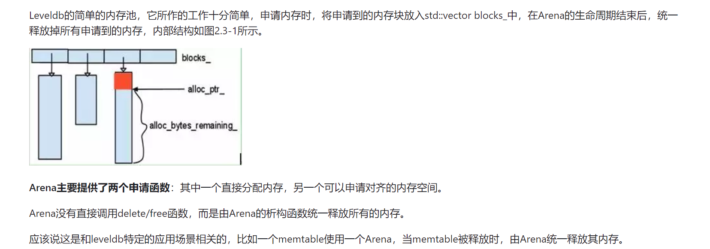
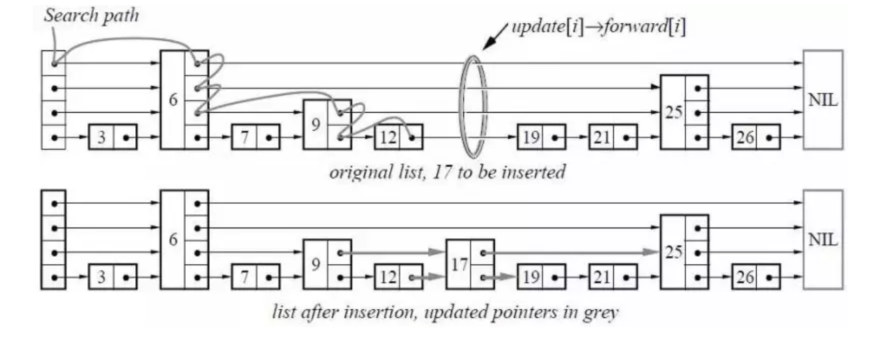

# Level DB疑惑点整理

### 字节序

大端字节序（Big-Endian）和小端字节序（Little-Endian）是两种不同的字节顺序，用于在计算机内存中表示多字节数据类型（例如整数和浮点数）。它们的主要区别在于字节的存储顺序。

1. **大端字节序（Big-Endian）**：在大端字节序中，数据的最高有效字节（Most Significant Byte，MSB）存储在最低地址处，而最低有效字节（Least Significant Byte，LSB）存储在最高地址处。换句话说，字节按照其权重的降序排列。

   例如，假设我们有一个 4 字节的整数 `0x12345678`，其内存表示如下（地址从上到下增加）：

   ```
   Address   |  Value
   ----------|---------
   0x1000    |  0x12
   0x1001    |  0x34
   0x1002    |  0x56
   0x1003    |  0x78
   ```

2. **小端字节序（Little-Endian）**：在小端字节序中，数据的最低有效字节（Least Significant Byte，LSB）存储在最低地址处，而最高有效字节（Most Significant Byte，MSB）存储在最高地址处。换句话说，字节按照其权重的升序排列。

   例如，对于相同的整数 `0x12345678`，其内存表示如下（地址从上到下增加）：

   ```
   Address   |  Value
   ----------|---------
   0x1000    |  0x78
   0x1001    |  0x56
   0x1002    |  0x34
   0x1003    |  0x12
   ```

大端字节序和小端字节序的选择取决于特定的硬件架构和操作系统。一些处理器（如 PowerPC 和 SPARC）使用大端字节序，而其他处理器（如 x86 和 ARM）使用小端字节序。在网络传输中，大端字节序（也称为网络字节序）通常是首选，因为它更符合人类的阅读习惯。

在处理跨平台数据传输和文件格式时，字节序的差异可能导致兼容性问题。为了解决这些问题，你需要在读取和写入数据时正确处理字节序，例如使用字节序转换函数（如 `htons`、`htonl`、`ntohs` 和 `ntohl`）或编写自定义的字节序转换代码。

#### htons htonl ntohs ntohl一般怎么使用

`htons`、`htonl`、`ntohs` 和 `ntohl` 是网络编程中常用的一组函数，用于处理字节序问题。它们的名称分别代表 "host to network short"、"host to network long"、"network to host short" 和 "network to host long"。

1. `htons`（host to network short）和 `htonl`（host to network long）：这两个函数将主机字节序转换为网络字节序（大端字节序）。`htons` 用于 16 位（short）的数据，`htonl` 用于 32 位（long）的数据。
2. `ntohs`（network to host short）和 `ntohl`（network to host long）：这两个函数将网络字节序转换为主机字节序。`ntohs` 用于 16 位的数据，`ntohl` 用于 32 位的数据。

以下是一些使用这些函数的例子：

```c
#include <stdio.h>
#include <arpa/inet.h>

int main() {
    // 16-bit value in host byte order
    uint16_t value16 = 0x1234;
    // 32-bit value in host byte order
    uint32_t value32 = 0x12345678;

    // Convert to network byte order
    uint16_t value16n = htons(value16);
    uint32_t value32n = htonl(value32);

    printf("16-bit value in network byte order: 0x%x\n", value16n);
    printf("32-bit value in network byte order: 0x%x\n", value32n);

    // Convert back to host byte order
    uint16_t value16h = ntohs(value16n);
    uint32_t value32h = ntohl(value32n);

    printf("16-bit value in host byte order: 0x%x\n", value16h);
    printf("32-bit value in host byte order: 0x%x\n", value32h);

    return 0;
}
```

在这个例子中，我们首先将主机字节序的值转换为网络字节序，然后再将它们转换回主机字节序。这种转换在网络编程中非常重要，因为不同的计算机系统可能使用不同的字节序，而网络协议通常使用大端字节序（网络字节序）。通过使用这些函数，我们可以确保数据在不同系统之间正确地传输。

### 变长存储(VarInt)

### Arean

##### 工作原理



内存池是一种内存管理策略，用于预先分配一块内存，然后在需要时从这块内存中分配小块内存。这种方法可以减少内存分配和释放的开销，提高内存利用率，并减少内存碎片。

Arena 是一种特殊类型的内存池，它用于管理一组相同大小的内存块。Arena 内存池的工作原理如下：

1. **初始化**：在初始化阶段，Arena 从系统中获取一块大的内存区域（称为 Arena），并将其划分为一组大小相同的内存块。这些内存块被组织成一个自由列表（free list），以便于分配和回收。
2. **分配**：当有内存分配请求时，Arena 会从自由列表中取出一个内存块，并将其返回给请求者。如果自由列表为空，Arena 可能需要向系统请求更多的内存。
3. **回收**：当内存块不再使用时，它会被返回到 Arena，并重新添加到自由列表中，以供后续的分配请求使用。
4. **销毁**：当 Arena 不再需要时，所有的内存块都会被回收，并将整个 Arena 返回给系统。

Arena 内存池的优点是内存分配和回收的速度快，因为它们只需要在自由列表中添加或删除内存块。此外，由于所有的内存块都是相同大小的，所以 Arena 可以有效地减少内存碎片。

然而，Arena 内存池也有一些缺点。首先，它只能有效地管理相同大小的内存块。如果需要分配不同大小的内存块，Arena 可能会浪费一些内存。其次，如果 Arena 中的内存块全部被使用，Arena 可能需要请求更多的内存，这可能会增加内存使用率和系统开销。

总的来说，Arena 是一种高效的内存管理策略，适用于需要快速分配和回收大量相同大小内存块的场景，例如对象池、内存数据库和高性能网络服务器

##### 简单实现

以下是一个简单的 Arena 内存池的 C++ 实现。这个实现使用一个 vector 来存储空闲的内存块，每个内存块都是一个固定大小的 char 数组。

```cpp
#include <vector>

class Arena {
public:
    // 构造函数，初始化 Arena
    Arena(size_t blockSize, size_t blockCount)
        : blockSize_(blockSize), blockCount_(blockCount) {
        for (size_t i = 0; i < blockCount_; ++i) {
            char* block = new char[blockSize_];
            freeBlocks_.push_back(block);
        }
    }

    // 析构函数，销毁 Arena
    ~Arena() {
        for (char* block : freeBlocks_) {
            delete[] block;
        }
    }

    // 分配一个内存块
    char* Allocate() {
        if (freeBlocks_.empty()) {
            return nullptr; // 或者请求更多的内存
        } else {
            char* block = freeBlocks_.back();
            freeBlocks_.pop_back();
            return block;
        }
    }

    // 回收一个内存块
    void Deallocate(char* block) {
        freeBlocks_.push_back(block);
    }

private:
    size_t blockSize_;
    size_t blockCount_;
    std::vector<char*> freeBlocks_;
};
```

使用这个 Arena 类，你可以创建一个内存池，然后从中分配和回收内存块：

```cpp
int main() {
    Arena arena(1024, 10); // 创建一个包含 10 个 1024 字节内存块的 Arena

    char* block = arena.Allocate(); // 从 Arena 分配一个内存块

    // 使用内存块...

    arena.Deallocate(block); // 将内存块回收到 Arena

    return 0;
}
```

请注意，这个实现是非常简单的，并未处理一些边缘情况，例如当 Arena 中的内存块用尽时。在实际使用中，你可能需要根据你的具体需求来扩展和改进这个实现，例如添加错误处理代码，或者在需要时请求更多的内存。

### Skip List



#### 关键数据结构（Node）

一个value，一个指向了后续Node的指针数组

```C++
struct Node {
        int value;
        std::vector<Node*> forward;

        Node(int value, int level)
            : value(value), forward(level, nullptr) {}
```

#### 关键思想

从上往下遍历forward指针，只要当前level的forward node 值大于要查找的值，就在当前node继续往下走

#### 原理及实现

Skip List（跳跃表）是一种基于概率平衡的数据结构，它允许快速搜索、插入和删除操作。Skip List 的主要思想是在有序链表的基础上添加多级索引，以便在查找时可以跳过部分元素，从而提高搜索效率。其时间复杂度与平衡树相似，为 O(log n)，但实现起来更简单。

Skip List 的原理如下：

1. 每个节点包含一个 key 和一个指向下一个节点的指针数组（称为前进指针）。
2. 第 0 级的指针数组包含指向链表中下一个节点的指针。
3. 更高级别的指针数组包含指向跳过一定数量节点的指针。级别越高，跳过的节点数量越多。
4. 节点的级别是随机生成的。每个节点都有一个基本级别（0 级），然后以一定的概率（通常为 1/2）升级到更高的级别。

以下是一个简单的 Skip List 实现，仅支持 `insert` 和 `search` 操作：

```cpp
#include <iostream>
#include <vector>
#include <cstdlib>
#include <ctime>

class SkipList {
public:
    // 构造函数，初始化 SkipList
    SkipList(int maxLevel)
        : maxLevel_(maxLevel), head_(new Node(-1, maxLevel)) {
        srand(time(0));
    }

    // 析构函数，销毁 SkipList
    ~SkipList() {
        Node* node = head_;
        while (node) {
            Node* next = node->forward[0];
            delete node;
            node = next;
        }
    }

    // 插入一个元素
    void insert(int value) {
        std::vector<Node*> update(maxLevel_, nullptr);
        Node* node = head_;

        for (int level = maxLevel_ - 1; level >= 0; --level) {
            while (node->forward[level] && node->forward[level]->value < value) {
                node = node->forward[level];
            }
            update[level] = node;
        }

        int newNodeLevel = randomLevel();
        Node* newNode = new Node(value, newNodeLevel);

        for (int level = 0; level < newNodeLevel; ++level) {
            newNode->forward[level] = update[level]->forward[level];
            update[level]->forward[level] = newNode;
        }
    }

    // 查找一个元素，如果找到，返回 true，否则返回 false
    bool search(int value) {
        Node* node = head_;

        for (int level = maxLevel_ - 1; level >= 0; --level) {
            while (node->forward[level] && node->forward[level]->value < value) {
                node = node->forward[level];
            }
        }

        node = node->forward[0];
        return node && node->value == value;
    }

private:
    struct Node {
        int value;
        std::vector<Node*> forward;

        Node(int value, int level)
            : value(value), forward(level, nullptr) {}
    };

    int randomLevel() {
        int level = 1;
        while (level < maxLevel_ && (rand() % 2)) {
            ++level;
        }
        return level;
    }

    int maxLevel_;
    Node* head_;
};

int main() {
    SkipList skipList(4);

    skipList.insert(3);
    skipList.insert(6);
    skipList.insert(7);
    skipList.insert(9);
    skipList.insert(12);

    std::cout << "Element 6: " << (skipList.search(6) ? "found" : "not found") << std::endl;
    std::cout << "Element 8: " << (skipList.search(8) ? "found" : "not found") << std::endl;

    return 0;
}
```

这个简单的 Skip List 实现包含一个 `Node` 结构体，用于存储元素值和前进指针数组。`insert` 和 `search` 函数实现了元素的插入和查找功能。

#### MaxLevel怎么确定

`max_level` 是 Skip List 中节点最大允许的级别。对于一个具有 `max_level` 级别的 Skip List，每个节点的级别（即前进指针数组的长度）将在 1 到 `max_level` 之间。较高级别的节点在查找过程中可以跳过更多的元素，从而加快查找速度。

在实际应用中，`max_level` 的值可以根据以下因素确定：

1. **数据集的大小**：对于较大的数据集，可以选择较大的 `max_level` 值，以便在查找过程中跳过更多的元素。然而，较高的 `max_level` 值也会增加每个节点的内存开销（因为需要存储更多的指针）。因此，需要在查找效率和内存开销之间找到一个平衡。
2. **概率因子（通常为 1/2）**：概率因子是用于确定节点级别的概率值。对于概率因子为 1/2 的 Skip List，每个节点的级别有 1/2 的概率升级到下一个级别。因此，可以根据概率因子和期望的查找效率来选择合适的 `max_level` 值。

一般来说，可以使用以下公式估算 `max_level` 的值：

```
max_level = log(N) / log(P)
```

其中，`N` 是数据集的大小，`P` 是概率因子（通常为 1/2）。

例如，对于一个包含 1000 个元素的数据集，可以选择 `max_level` 为 10（`log(1000) / log(2) ≈ 10`）。这样，查找操作的平均复杂度将为 O(log 1000) = O(10)。

请注意，这个公式仅用于估算合适的 `max_level` 值。在实际应用中，可以根据具体的性能需求和内存限制来调整 `max_level` 的值。